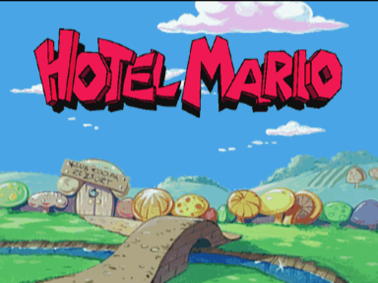

# HotelMarioRecomp

*Hotel Mario* (USA) running as a native **Philips CD-i** build on the sibling
[`cdirecomp`](https://github.com/mstan/cdirecomp) static-recompilation engine.

> ### ⚠️ Very early development
> This is a **research preview**. The real CD-RTOS BIOS boots, the player shell
> opens the disc, the Philips Interactive Media bumper plays with decoded XA
> audio, and *Hotel Mario* reaches its **title card and one-player Stage 1**.
> Intro transitions and repeated death/restart paths now work in recorded
> probes. Full campaigns and save/restore are not yet certified.
> Expect rough edges and breaking changes.

<p align="center">
  
</p>
<p align="center">
  <sub><i>Hotel Mario</i> reaching its title card through the real recompiled BIOS — booted
  through the real CD-i system ROM.</sub>
</p>

## How it works

This repo is thin. It contains only game-specific build glue, identity
metadata, and acceptance tooling — it builds the `cdirecomp` runtime with a
Hotel-Mario-specific product identity and asset contract. It **does not**
contain a CD-i BIOS, any Hotel Mario disc data, generated game code, or any
emulator/tooling forks. All of the interesting work lives in `cdirecomp`, whose
philosophy is **low-level, static, native-first**: the whole CD-RTOS system ROM
is recompiled and executed as native C (no OS-9 HLE), and the game boots on top
of it exactly as on hardware.

## What you must supply

You provide both, from your own legally dumped media (see [DISC.md](DISC.md) for
the verified identities):

1. A 512 KiB CD-i player BIOS (`cdi490a.rom`).
2. A *Hotel Mario* (USA) raw Mode-2 `.cue` + `.bin` image (select the `.cue`).

The runtime validates the exact generated BIOS identity and disc format at
startup. Loaded native modules must match their complete image SHA-256;
the entire disc's identity is recorded by acceptance tooling. Neither asset
is embedded in the executable.

## Building & running

Place this repo beside `cdirecomp`:

```text
Projects/
├── cdirecomp/
└── HotelMarioRecomp/
```

Requirements: CMake, Ninja (or another generator), a C11 compiler, and SDL2.

```powershell
./tools/build.ps1 -Disc "path/to/Hotel Mario (USA).cue"
./tools/launch.ps1    # first run asks for the BIOS + disc, then remembers them
```

The first launch saves the chosen paths in git-ignored `bios.cfg` / `disc.cfg`
sidecars; later launches reuse them.

Generate the BIOS in the sibling engine first, using its documented
`CdiRecompBios` workflow. `build.ps1 -Disc` generates all distinct executable
OS-9 modules before building the product. Generated code remains local.
`-ModuleSeeds` optionally adds image-bound callbacks observed during real
execution and exported by the engine's `collect_module_seeds.py`; this is
offline static recompilation. No HLE replacement is enabled.

**Controls:** on Windows the **mouse controls Hotel Mario directly** — it drives
the CD-i pointer and both buttons through the recompiled runtime's input model,
in-game as well as in the shell. Arrows/WASD also move the pointer; Enter/Space/Z is button
1; Backspace/X is button 2; F11/Alt+Enter toggles fullscreen; Esc exits.

## Acceptance gate

With your own BIOS and disc:

```powershell
./tools/accept-attract.ps1 -Bios path/to/cdi490a.rom -Disc path/to/HotelMario.cue
```

It enters through the real player-shell input path and checks the pixel-exact
title, populated intro planes, clean bumper/intro XA audio with zero drops,
expected disc progress, zero native dispatch misses, and real-time field pacing.
See [ISSUES.md](ISSUES.md) for the intentionally narrow current certification.

## License

[PolyForm Noncommercial License 1.0.0](LICENSE) — © 2026 Matthew Stan. Covers
this repository's build glue and tooling only. It grants no rights to Nintendo,
Philips, or any other third-party intellectual property; you must supply your
own legally obtained BIOS and disc image.
